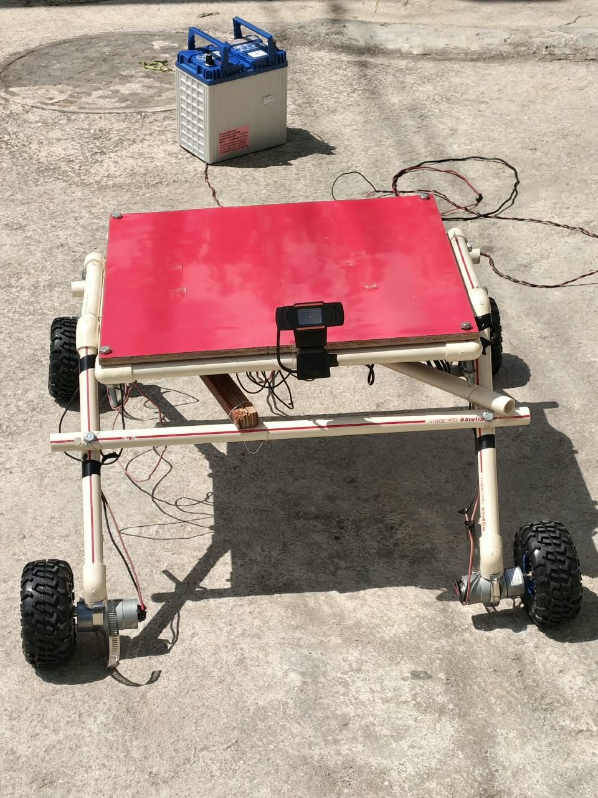

<div align="center">



# Rover

### A rover that looks for a person and drives after them.

Raspberry Pi 3 does the seeing and the deciding.<br>
An ESP32 turns the decisions into motor PWM.


*No laptop. No internet. No cloud. Plug in the battery and it follows.*

</div>

---

## The pipeline

```
┌─ USB webcam ──┐   ┌─ Raspberry Pi 3 ─────┐   ┌─ ESP32 ──────┐   ┌─ motors ─┐
│               │   │                      │   │              │   │          │
│   640 x 480   ├──>│  YOLO11n  192 x 320  ├──>│  PWM output  ├──>│   o  o   │
│    15 fps     │   │  biggest box = near  │   │              │   │          │
│               │   │  dist = k / width    │   │    500 ms    │   │   o  o   │
│               │   │  -> throttle + steer │   │   watchdog   │   │          │
└───────────────┘   └──────────────────────┘   └──────────────┘   └──────────┘
       USB              ~3 fps · ~340 ms           "M<l>,<r>"        skid steer
```

**Distance comes from the box _width_, not its height.** The camera sits low on the
frame, so from 1–2 m in a standing person's box already touches the top and bottom of the
picture — its height stops changing. The width keeps growing right up to the rover. One
pinhole constant `k` (box width × distance) is measured once by calibration, and from then
on `distance = k / width`.

Every frame, it asks:

| Situation | | Action |
|---|:-:|---|
| Farther than `--stop-dist` | **GO** | drive forward, faster the farther, steering to the box centre |
| At `--stop-dist` (40 cm) or closer | **STOP** | |
| Box fills 90 % of the picture width | **STOP** | they are right in front of it |
| Nobody detected | **STOP** | |
| Not calibrated | **STOP** | it refuses to drive blind |

There is 10 cm of slack before it starts again, so it doesn't stutter at the stop line.

---

## Stopping is the default

A machine that drives itself at a person is only safe if *stopping* is what happens when
anything goes wrong. These are the paths that got the attention.

**ESP32 watchdog.** The firmware kills the motors if drive commands stop arriving for
500 ms. A crashed, unplugged or hung Pi cannot leave the rover driving.

**Command resend.** One YOLO frame on a Pi 3 takes ~340 ms, *longer* than that watchdog,
so a thread resends the latest command at 10 Hz — but only while it is younger than 1 s,
so a stuck control loop still lets the watchdog fire.

**No stale frames.** `camera.py` returns `None` rather than a frame older than 500 ms.
Acting on an old picture is worse than not acting: a frozen camera would hold the rover's
view still while the rover keeps moving.

**Clean exit.** SIGTERM and Ctrl+C send a motor stop on the way out. The control loop
lives in its own function, because on Python 3.11 a signal landing on a tight loop's jump
can skip a `try/finally` in the same frame — and with it that stop.

**Port check.** `--port auto` only accepts a serial port that answers like the rover
firmware (`DRIVE TIMEOUT`). The AMB82 camera board has the same USB-serial chip.

---

## Hardware

| Part | Notes |
|---|---|
| **Raspberry Pi 3** | Raspberry Pi OS Bookworm, 64-bit. Vision and control. |
| **ESP32 dev board** | Motor PWM and Bluetooth manual drive. USB to the Pi. |
| **4 × geared DC motors** | Dual-PWM drivers (`RPWM`/`LPWM` per side, e.g. BTS7960). Skid steer. |
| **USB webcam** | Any UVC camera, 640×480 MJPEG. |
| **12 V lead-acid battery** | For the motors. The Pi needs its own solid 5 V supply. |
| **PVC frame, plywood deck** | As in the photo. |

**ESP32 pins** — left `RPWM 26` / `LPWM 25`, right `RPWM 18` / `LPWM 19`
(`esp32/bt_rc_car/bt_rc_car.ino`).

> [!TIP]
> Want the camera off the Pi's USB bus? An **AMB82 Mini** can replace the webcam, either
> over Wi-Fi (RTSP) or as a plain USB camera — see [`amb82/`](amb82/).

---

## Quick start

```bash
export PI=rasp@<pi-address>     # or edit the PI= default at the top of pi.sh

./pi.sh key                     # 1. one time: SSH key, no more password prompts
./pi.sh setup                   # 2. venv + CPU torch + ultralytics + onnxruntime
./pi.sh calibrate 1m            # 3. stand 1 m from the camera, facing it, hold still
./pi.sh run --port auto         # 4. go
```

Then open **`http://<pi>:8080/`** in any browser — phone included — to see what it sees.

<details>
<summary><b>What each step actually does</b></summary>

<br>

**Flash the ESP32 first.** Open `esp32/bt_rc_car/bt_rc_car.ino` in the Arduino IDE, select
your ESP32 board, upload. The Serial Monitor at 115200 prints `=== ROVER READY ===`. Plug
it into the Pi.

**`setup`** installs the **CPU** build of torch on purpose — the default aarch64 wheel
drags in ~2 GB of CUDA a Pi cannot use — pins numpy to the system version picamera2 was
built against, and adds `onnxruntime`, which runs yolo11n in **~340 ms** per frame against
PyTorch's **~570 ms**.

**`calibrate`** needs 10 steady frames, then writes `calibration.json` on the Pi. Distances
accept `1m`, `80cm`, `30in`, `2ft`; a bare number is centimetres. Recalibrate if you change
the capture size or move the camera. **The rover will not drive until you do.**

**`run`** streams output live to your terminal and pulls the log back when you Ctrl+C. Drop
`--port auto` for a dry run that prints every decision without touching the motors.

</details>

> [!WARNING]
> **Always `./pi.sh drivetest` a new build with the wheels off the ground.** It runs 1 s
> forward, 1 s backward, and confirms "forward" really *is* forward before the follower is
> trusted to decide it.

### Make it start by itself

```bash
./pi.sh autostart on            # systemd service, runs at every power-on
```

Options for the boot service live in `rover.env` on the Pi:

```ini
ROVER_ARGS="--port auto --stop-dist 40cm --full-speed-dist 150cm --max-pwm 140"
```

`./pi.sh restart` pushes new code into the running service without sudo — it stops the
follower, systemd starts it again ~10 s later.

---

## `pi.sh` — the only thing you type

It never runs the rover on your laptop. It rsyncs `pi3/` to the Pi over SSH, runs the
command **there**, and copies the logs back into `pi_logs/`. Every run is saved on the Pi
as `logs/<name>-<timestamp>.log`, newest 60 kept.

| Command | What it does |
|---|---|
| `key` | install an SSH key on the Pi |
| `setup` | push, then build the venv and check the camera |
| `push` | copy `pi3/` to the Pi |
| `run [args]` | push, run the follower with live output here, pull the log |
| `start` / `stop` | run it in the background on the Pi / stop it |
| `restart` | push new code into the running boot service |
| `calibrate [dist]` | measure the distance constant (default 1 m) |
| `autostart on\|off\|status` | run the follower at every power-on |
| `drivetest [pwm]` | wheels off the ground: 1 s forward, 1 s backward |
| `status` | temperature, throttling, hotspot, webcam, serial, follower, calibration |
| `logs` / `pull` | watch the Pi's latest log / copy every log into `pi_logs/` |
| `view` / `detect` | camera window on the Pi's desktop, plain or with boxes and IDs |
| `watch` | the running follower's view, in a window on your laptop |
| `camtest` / `usbtest` | why the ribbon camera isn't seen / does the webcam work |
| `hotspot` | one time: the `RoverCam` fallback access point |
| `sh [cmd]` | shell on the Pi, or one command in the project folder |

Run `./pi.sh` with no arguments for the same list.

---

## Tuning

```
--stop-dist 40cm           stop at this distance or closer
--full-speed-dist 150cm    full speed from this far away
--min-pwm 90               where the wheels actually start turning
--max-pwm 150              full speed, of 255
--steer-gain 0.8           0 drives straight only
--conf 0.5                 YOLO person confidence
--source usb               usb, /dev/videoN, an RTSP URL, or csi
--cap 640x480              capture size
--rotate none              cw/ccw/180 for a camera mounted sideways
--view 8080                live-view port, 0 to turn it off
```

Measured on a Pi 3: **~3 fps, ~340 ms per frame**, yolo11n exported to ONNX at 192×320.
The webcam runs at 15 fps; the follower just takes the newest frame each time.

---

## What's in here

```
pi.sh                     everything you type: push, run, pull logs
│
├─ pi3/                   what runs on the Raspberry Pi
│    follow_rover.py        the follower: camera -> YOLO -> distance -> wheels
│    camera.py              USB / RTSP / ribbon camera sources, newest frame only
│    control.py             model choice, PD loop, target lock, HUD drawing
│    webview.py             MJPEG server — the live view at :8080
│    camview.py             live camera window, for aiming and delay tests
│    detectview.py          live window with person boxes, track IDs and fps
│    yolo11n.pt             the model (yolo11n_192x320.onnx is the fast export)
│    rover_track.yaml       ByteTrack settings tuned for a partly hidden person
│
├─ esp32/bt_rc_car/       ESP32 firmware: "M<left>,<right>" plus Bluetooth keys
├─ amb82/rover_cam/       AMB82 Mini as an RTSP camera over Wi-Fi
├─ amb82/rover_cam_usb/   AMB82 Mini as a plain USB camera (no Wi-Fi at all)
└─ pi_logs/               every run's log, pulled back from the Pi
```

---

## Out in the field

The Pi carries a **`RoverCam`** hotspot (`./pi.sh hotspot`) at the lowest autoconnect
priority: home Wi-Fi wins when it is in range, and when it isn't — outdoors — the Pi brings
up its own network at `10.42.0.1`, so a laptop or phone can still reach the live view and a
shell. It is 2.4 GHz WPA2-AES with PMF **off**, which is what the Pi 3's brcmfmac radio
handles reliably in AP mode.

### Driving it by hand

The ESP32 also takes single-character commands over Bluetooth (pair with **`Rover`**) or
USB serial, from any of the common RC-car apps:

<div align="center">

`F` forward · `B` back · `L`/`R` spin · `G`/`I` fwd-left/right · `H`/`J` back-left/right · `S` stop · `0`–`9` speed · `q` full

</div>

A manual command takes over from the Pi; the Pi's next `M` command takes it back.

---

## When it misbehaves

| Symptom | Where to look |
|---|---|
| `NOT CALIBRATED - will not drive` | `./pi.sh calibrate 1m` |
| `no rover ESP32 found` | ESP32 plugged into the Pi? `./pi.sh status` lists serial ports — and the user must be in `dialout` |
| `no frames from a USB webcam` | `./pi.sh usbtest` — lists the device, its formats, reads 5 s of video |
| Ribbon camera not detected | `./pi.sh camtest` — probes ov5647/imx219/imx708/imx477 and says whether the ribbon is reversed, loose, or the wrong sensor |
| Rover drives **backward** | `./pi.sh drivetest` with the wheels up, then swap the motor leads or the `L_`/`R_` pins |
| Random reboots, sluggish fps | `./pi.sh status` → `power` other than `0x0` is undervoltage: the Pi needs a stronger 5 V supply |
| What happened last run | `pi_logs/latest.log`, or `./pi.sh logs` live |

---

<div align="center">

**Apache 2.0** · see [LICENSE](LICENSE)

</div>
